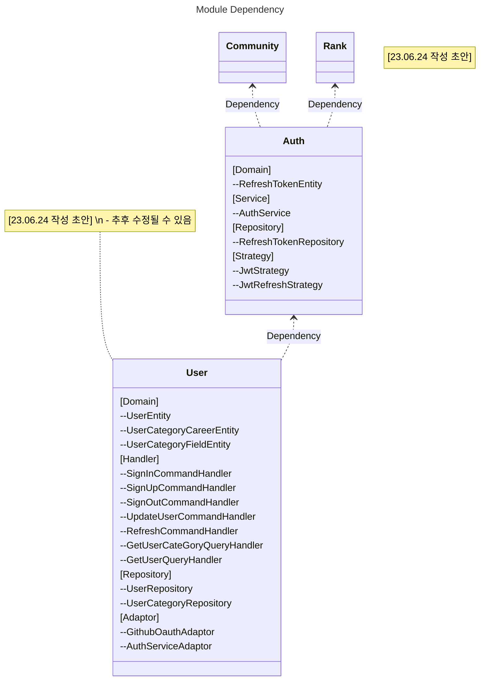

# HOW TO USE mermaid

---

## 참고자료

**- Mermaid Syntax** : [https://mermaid.js.org/intro/](!https://mermaid.js.org/intro/)

diagram 작성 세부 문법은 Diagram Syntax 항목에서 확인할 수 있고, 사용 예시는 가장 아래 Other Examples에서 확인 가능합니다.

**- Mermaid CLI** : [https://github.com/mermaid-js/mermaid-cli](!https://github.com/mermaid-js/mermaid-cli)

**- Markdown Preview Mermaid Support** : MarkDown preview와 비슷한 VS Code 익스텐션입니다. Mermaid diagram preview 기능을 지원합니다.

 

## 작성 요령

### 1. 위의 Syntax 자료를 통해 diagram 작성 문법을 학습한다.

 

### 2. module 간 의존성 관련 수정 사항을 기재한다.

module-dependency-diagram.mmd 파일에 **Class Diagram**으로 기재한다.

**Title : Module Dependency 기재사항**

1. 모듈 별로 모듈이 갖고 있는 domain entity를 멤버변수로 적는다.

2. {domain module}.module.ts에 등록한 provider를 멤버변수로 적는다.

> 같은 레이어끼리 모아서 작성한다.
>
> handler, repository, service 등 주요 provider는 전부 작성한다.

3. 모듈 사이 의존 관계를 표현한다.

> 의존성을 생성자 주입한 것만 우선 기재한다.

4. 메모가 필요한 경우 함께 기재한다.

 

### 3. 2번에서 기재한 provider class를 중심으로 의존 관계를 기재한다.

provider-dependency-diagram.mmd 파일에 기재한다.

**Title : Provider Dependency 기재사항**

1. domain entity 클래스 내부에 구현된 메소드를 적는다.

> domain entity는 다른 객체에 의존하는 것을 최소화 해야하기 때문에 멤버 변수가 존재하면 안된다.
>
> 단, 외부 의존성(npm package 등)은 불가피하게 사용해야 할 수도 있다. 외부 의존성이 존재하는 경우 멤버변수로 기재한다.
>
> ex) ulid

2. {domain module}.module.ts에 등록한 provider class 내부에 구현된 멤버변수와 메소드를 적는다.

> handler, repository, service 등 주요 provider는 전부 작성한다.
>
> 최대한 꼼꼼하게 작성해주세요.
>
> > 자식 클래스라면 부모클래스도 작성. 부모클래스가 추상클래스라면 추상클래스인 것도 작성하고 관계 표시
> > DI(Dependency Injection) 적용한 경우 구현한 interface(port 등)를 작성하고 관계 표시
> > 관계는 상속, 합성, 포함, 1:1, 1:다 등 표시
> > 멤버 변수의 타입, 메소드의 인자와 리턴 값 표시
>
> > ex) UserRepository(DI)
>
> 같은 의존대상 끼리 모아서 작성한다.

3. 모듈 사이 의존 관계를 표현한다.

> 추후 타입 의존, 외부 패키지 의존 등 다양한 의존성 주입 대상을 기재할 예정.

4. 메모가 필요한 경우 함께 기재한다.

 

## Example

